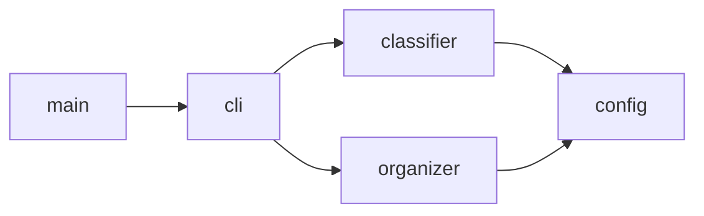
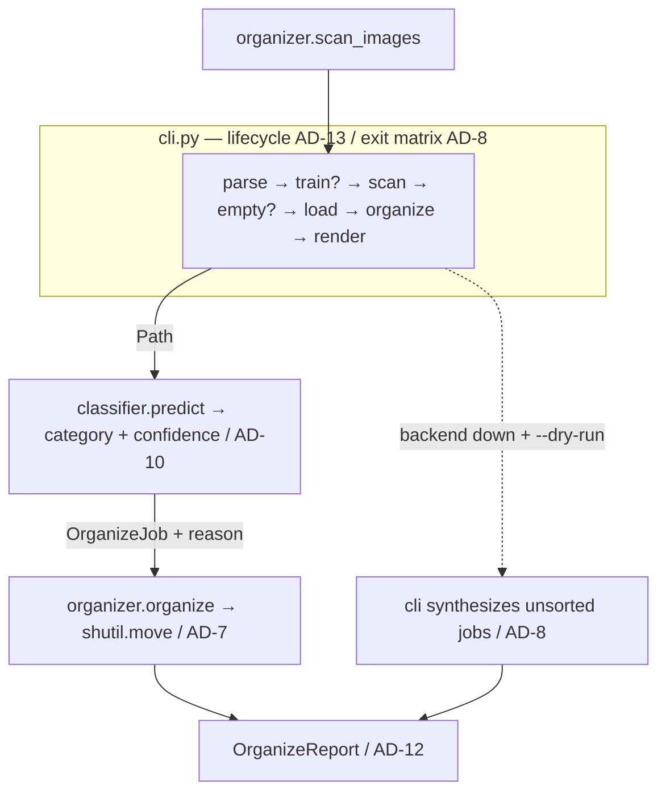

# Architecture Spine — meme-classifier

## Design Paradigm

**Layered single-process CLI + strategy backends.** One process, no server, no concurrency.

| Layer | Module | Owns |
| --- | --- | --- |
| Entry | `main.py` | `SystemExit(main())` only |
| Orchestration | `cli.py` | argparse (PRD §2.1 surface), run lifecycle, exit codes, rendering |
| Domain | `organizer.py` | scan, collision-safe moves, `OrganizeReport`/`OrganizeJob`, fixture labels (stdlib-only) |
| Domain | `classifier.py` | `BaseClassifier` ABC (Strategy seam), backends, mapping/threshold routing |
| Foundation | `config.py` | every tunable: categories, extensions, threshold, backends, paths, mapping, floors |

## Invariants & Rules

### AD-1 — Kebab-case folders, snake_case modules; declared write roots

- **Binds:** all file/folder creation
- **Prevents:** hyphenated modules that fail to import; write-scope drift story by story
- **Rule:** Folders are kebab-case; importable Python files are snake_case (category IDs double as folder names, AD-9). All writes are confined to the `--output` tree, `models/`, and the uv/Keras weight cache; **any new on-disk folder must be named in an AD before a story creates it.** `[ADOPTED]`

### AD-2 — Flat root module layout

- **Binds:** all new code
- **Prevents:** package/`src/` restructurings that break `conftest.py` bootstrap; uncontrolled shared-type modules
- **Rule:** Modules live flat at repo root; no `__init__.py` hierarchy, no `src/`. A new root module may be imported by **at most one** of `{cli, classifier, organizer}` — shared types have fixed homes (AD-6). `[ADOPTED]`

### AD-3 — config.py is the single source of truth

- **Binds:** FR-A1, FR-A2, FR-A3, FR-A9; all modules; tests
- **Prevents:** duplicated constants drifting apart across stories
- **Rule:** Defined once in `config.py`: categories, image extensions, threshold default `0.45`, backend names, default I/O paths, **label→category mapping structure**, **`DEFAULT_MODEL_PATH`**, **`ACCURACY_FLOOR` / `UNSORTED_SHARE_FLOOR`**, fixture default. CLI flags are the only override surface (NFR-A4); every flag maps to exactly one `config.py` name; no env vars, no module-level globals. `classifier` reads the mapping, never re-declares it; no on-disk mapping file exists. `[ADOPTED]`

### AD-4 — ML strictly behind the classifier seam

- **Binds:** FR-A2, FR-A9, NFR-A1
- **Prevents:** TensorFlow leaking into organizer/cli/config so TF-less QA runs die
- **Rule:** TensorFlow and NumPy import **only** in `classifier.py`. Pillow may import in `classifier.py` and in `tests/` fixture helpers. `organizer.py`, `cli.py`, `config.py` stay fully stdlib (NFR-A1); organizer tests must pass with TF uninstalled — TF-dependent backend tests live in a separate test module and skip when TF is absent. Backends implement `BaseClassifier` (`load`/`predict`); `get_classifier(name, threshold=…)` validates against `config.MODEL_BACKENDS`. `[ADOPTED]`

### AD-5 — Prompt log is append-only

- **Binds:** all AI-assisted work
- **Prevents:** split audit trails across working directories
- **Rule:** Append every AI prompt verbatim to `PROMPTS_LOG.md` at the **workspace root (repo parent, `<project>/../PROMPTS_LOG.md`)**, resolved once per session; never create a second log inside the repo; never rewrite or delete entries. `[ADOPTED]`

### AD-6 — Dependency direction and shared-type ownership

- **Binds:** every module and every story touching imports or shared types
- **Prevents:** import cycles; forked dataclasses at the seams
- **Rule:** Imports flow `main → cli → {classifier, organizer} → config` only; `organizer` and `classifier` never import each other. `ClassificationResult` lives in `classifier.py`; `OrganizeJob` (with `reason: str | None`) and `OrganizeReport` live in `organizer.py`; neither is relocated, duplicated, nor forked — field additions extend the same classes.



### AD-7 — One disposition owner for failed predictions

- **Binds:** FR-A2, AC-A4
- **Prevents:** three-way corrupt-file divergence (skip vs move vs fatal); reasons lost in the log
- **Rule:** Any predict-stage failure is converted **in `cli.run`** to `OrganizeJob(category="unsorted", reason=<failure text>)` — organizer defines the field, cli fills it — and surfaces in `OrganizeReport.errors`. Logging is optional, never the sole carrier. Run continues; `organizer` never inspects images; `classifier` never moves files.

### AD-8 — Backend availability and exit-code contract

- **Binds:** FR-A6, FR-A8, AC-A8, AC-A9
- **Prevents:** per-story exit-code drift; environment-dependent demos; fallback implemented twice
- **Rule:**
  - **All model/network I/O (incl. ImageNet weight fetch) happens inside `load()`**; `predict()` never fetches. Any `load()` failure follows the matrix below.
  - Missing input dir → exit `1`. Backend unavailable + non-dry run → exit `2`. Backend unavailable + `--dry-run` → proceed with fallback (AD-13), exit `0`. Empty inbox after scan → empty report, exit `0` (checked before `load()`). Any reported non-move (refused, failed, skipped) leaves exit `0`.
  - The backend-down fallback is **cli-side job synthesis only** — no fallback name is added to `config.MODEL_BACKENDS` or `--backend` choices.
  - argparse owns **value-shape** validation only (`--threshold` in (0, 1], `choices=`); **path existence** is validated in `cli.run` before any side effect and maps to exit `1`. Argparse usage errors exit per its default (`2`) — AC-A8 asserts backend-unavailable `2` only after a successful parse.

### AD-9 — Category authority is config.CATEGORIES

- **Binds:** FR-A3, FR-A4, NFR-A2, AC-A6
- **Prevents:** two category lists diverging; mapping typos silently stopping organization
- **Rule:** `config.CATEGORIES` (five kebab IDs incl. `unsorted`) is the only allow-list. The **classifier layer normalizes its output** — member check against `config.CATEGORIES`; any non-member becomes `category="unsorted"` with the raw label recorded as reason — *before* anything reaches `organizer`. `organizer.sanitize_category` is defense-in-depth path-traversal validation only, never the primary disposition path.

### AD-10 — Classification contract and threshold seam

- **Binds:** FR-A2, FR-A3, AC-A6, AC-A7
- **Prevents:** threshold logic reimplemented per backend; forked ABC signatures; per-backend confidence semantics
- **Rule:** Every backend exposes a **five-element distribution over `config.CATEGORIES`** (softmax/normalized); a binary-artifact output is rejected at `load()` as unavailable (exit matrix, AD-8). Confidence = top-1 probability of a mapped label; routing (unmapped **or** score < threshold → `unsorted`) happens once, inside the classifier layer. The **one threshold hand-off** is `get_classifier(name, threshold=…)` → constructor: `cli.run` passes `args.threshold` and never re-routes; `organizer` receives a final category and never recomputes confidence.

### AD-11 — Training artifact flow

- **Binds:** FR-A9, NFR-A4, AC-A11
- **Prevents:** hard-coded model paths; train/serve using different files
- **Rule:** `config.DEFAULT_MODEL_PATH` is the only literal model path; no other module contains `custom-cnn.keras`; `classifier` receives the path as a constructor argument. `--train <root>` consumes `<root>/<category>/*.jpg` (min ~10 images/category). Artifact writing obeys the run lifecycle (AD-13); these writes are the explicit exception to NFR-A3's zero-writes rule.

### AD-12 — Report contract

- **Binds:** FR-A7, AC-A1..A8, AC-A6, AC-A7
- **Prevents:** divergent report shapes; fixture plumbing split across modules; floors invented per story
- **Rule:** `OrganizeReport` is the single source of run output: per-category planned/moved counts (refused/failed/skipped **excluded** from `counts_by_category`), separate `refused`/`failed`/`skipped` counters with reasons, and fixture accuracy when `--fixture <root>` is passed. Expected labels come from `organizer.read_fixture_labels(root)`; accuracy is computed inside `organize()`; floors read `config.ACCURACY_FLOOR` / `config.UNSORTED_SHARE_FLOOR`. `cli` passes roots through and renders only — including rendering `organizer.empty_report()` on early-exit paths; `cli` never instantiates `OrganizeReport` directly.

### AD-13 — Run lifecycle and write-scope

- **Binds:** FR-A6, FR-A8, FR-A9, NFR-A3, AC-A1, AC-A9, AC-A10
- **Prevents:** dry-run mutations; `--train` ordering/exit ambiguity; reports missing on flagship demo paths
- **Rule:** `cli.run` order: **parse → train (if `--train`: runs before scan, does not require an inbox, returns its own report and exit; writes the artifact only when `--dry-run` is absent — under `--dry-run` training is skipped with a warning; bad train root → exit `1`, model/TF failure → exit `2`) → scan (missing dir → `1`) → empty-inbox check → `load()` → organize → render → `0`.** Under `--dry-run` **everywhere**: zero filesystem mutations (no mkdir, no cache-priming) — destinations are computed against a virtual tree. A report is rendered before **every** return.

### AD-14 — CLI surface frozen to PRD §2.1

- **Binds:** FR-A1, FR-A6, NFR-A4; all flag-adding stories
- **Prevents:** two stories defining mutually exclusive parsers; silent default flips
- **Rule:** Flag names, spellings, and defaults come from `docs/product-requirements.md` §2.1/§2.3: `-o/--output`, `-r` recursion **off** by default, `--backend`, `--threshold`, `--dry-run`, `--fixture`, `--train`, `--model-path`. Existing code drift (`--output-dir`, `--no-recursive` default-on) is reconciled in a dedicated first story before feature work; each flag maps to exactly one `config.py` default.

## Consistency Conventions

| Concern | Convention |
| --- | --- |
| Naming | Kebab folders / snake modules (AD-1); category IDs = `config.CATEGORIES` (AD-9); collision suffix `stem-N.suffix` capped at 1000 |
| Data & formats | Exit codes `0/1/2` per AD-8/AD-13; confidence float (0, 1], default `0.45`; six image extensions from `config.IMAGE_EXTENSIONS` |
| Errors & logging | stdlib `logging`, no `print` debugging; per-file failures → `OrganizeReport` counters + reasons (AD-12), never batch-abort |
| Config | CLI flags only (AD-3); CLI surface frozen to PRD §2.1 (AD-14) |
| Testing | `uv run --with pytest pytest -q` (never bare `python`/`pytest`); organizer suite green with TF absent; TF backend tests in a separate skipping module |
| Demo ops | First `mobilenet` `load()` downloads ImageNet weights (~14 MB) — pre-warm cache before defense demos (offline risk → exit 2, AD-8) |

## Stack

| Name | Version |
| --- | --- |
| Python | 3.13 target (NFR-A5); **provisioning pending** — today `uv run` resolves 3.12.13; first build task adds `pyproject.toml` + `requires-python` (Deferred) |
| TensorFlow | >=2.21,<2.22 (2.21.0 = latest stable on cp313, verified PyPI 2026-09-27; pin deliberately excludes 2.22+/cp314 per NFR-A5) |
| keras | TF-managed (3.x) — carries the MobileNetV2 API |
| numpy | >=1.26 (TF 2.21 metadata floor) |
| Pillow | >=10.0 (minimum) |
| pytest | >=8.0 (minimum) |
| uv | 0.12.1 (host tool runner) |
| Host | Windows, run-from-source CLI; no deploy target |

## Structural Seed



```text
meme-classifier/
  main.py cli.py config.py classifier.py organizer.py conftest.py
  tests/test_organizer.py  tests/test_backends.py (TF, skips if absent)
  tests/fixtures/labeled/  # AC-A6 fixture (build phase)
  data/inbox/  data/organized/   # runtime roots (AD-3 defaults)
  models/custom-cnn.keras        # config.DEFAULT_MODEL_PATH (AD-11), git-ignored at build
  requirements.txt  pytest.ini  AGENTS.md  docs/
```

**Operational envelope:** single dev/grader machine, run-from-source; no services; network only for the one-time weight fetch inside `load()` (AD-8). On-disk writes confined to the three AD-1 roots.

## Capability → Architecture Map

| Capability | Lives in | Governed by |
| --- | --- | --- |
| FR-A1 scan / extensions / recursion default off | `organizer.scan_images` + PRD-frozen flags | AD-3, AD-9, AD-14 |
| FR-A2 backends (mobilenet default, custom-cnn) | `classifier.py` | AD-4, AD-10, AD-6 |
| FR-A3 confidence + threshold routing | `classifier.py` ← `get_classifier(threshold=)` | AD-3, AD-10 |
| FR-A4/FR-A5 moves + collision suffix | `organizer.organize` / `unique_destination` | AD-7, AD-9 |
| FR-A6 dry-run (backend-less, zero writes) | `cli.run` fallback + lifecycle | AD-8, AD-13 |
| FR-A7 report incl. refused/failed | `OrganizeReport` → `cli` render | AD-12, AD-6 |
| FR-A8 exit codes | `cli.run` only | AD-8, AD-13 |
| FR-A9 train / `--model-path` | `classifier.py` + `cli` lifecycle | AD-11, AD-13, AD-4 |
| AC-A6/AC-A7 fixture accuracy | `organizer.read_fixture_labels` → `organize()` → report | AD-12, AD-3 (floors) |
| NFR-A1 stdlib organizer | `organizer.py` imports | AD-4 |
| NFR-A2 path-traversal allow-list | `organizer.sanitize_category` (defense-in-depth) | AD-9 |
| NFR-A3 idempotent re-runs | scan `exclude=` output root + AD-1 write roots | AD-3, AD-13 |
| NFR-A5 environment | `requirements.txt` + uv provisioning (build phase) | Stack row, Deferred |

## Deferred

- **uv environment provisioning** — `pyproject.toml` + `requires-python = "3.13"` + lockfile; first build-phase task. NFR-A5 is unenforced until then (today `uv run` resolves 3.12.13).
- **Label→category mapping table content/coverage** — structure lives in `config.py` (AD-3); entries ship with the mobilenet story; PRD OQ-1 calibrates floors against it.
- **Training hyperparameters** (layers, epochs, split) — lab specifies architecture only; custom-cnn story decides, smoke-train on fixture.
- **`docs/system-architecture.md` sync + `bmad-plan.md` status board** — narrative companions; revisit at correct-course/sprint-planning; spine is authoritative for invariants.
- **CI / test automation pipeline** — TEA phase, not yet invoked.
- **Packaging (pip-installable, exe)** — outside lab scope (run-from-source suffices).
